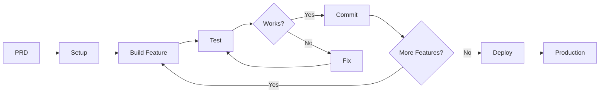

# AI Development Workflow: Idea to Deployed App

This guide outlines the optimal workflow for building applications using AI agents, from initial idea to deployed product.

## 🚀 Complete Workflow Overview

### Phase 1: Idea Refinement (5-30 minutes)
1. **Start with PRD Builder**
   - Reference the `ai-guided-prd-builder.md`
   - AI analyzes your idea complexity
   - Skip questions if idea is detailed
   - Answer 2-3 questions if needed
   - Get PRD + 3 template recommendations

### Phase 2: Project Setup (First AI Session - 1 hour)
1. **Choose template** from recommendations
2. **First prompt**: 
   ```
   "Create [app name] using [chosen template]. Include:
   - CapRover deployment files (Dockerfile, captain-definition)
   - Basic project structure
   - Authentication setup
   - Database configuration
   Here's my PRD: [paste PRD]"
   ```
3. **AI generates**:
   - Complete project scaffold
   - Docker configuration
   - Environment setup
   - README with next steps

### Phase 3: Core Development (3-10 AI Sessions)
**Each session pattern:**
1. **Start session**: "Continue building [app]. Current state: [what's done]. Next: implement [specific feature from PRD]"
2. **AI builds feature** in isolation
3. **Test immediately** in browser/terminal
4. **Fix any issues** in same session
5. **Commit working code** before ending session

**Session breakdown example:**
- Session 2-3: Core data models and API
- Session 4-5: Main UI components
- Session 6-7: Key user flows
- Session 8-9: Additional features
- Session 10: Polish and optimization

### Phase 4: Testing & Refinement (1-2 sessions)
1. **Integration testing**: "Add Puppeteer E2E tests for main user flows"
2. **Performance**: "Optimize for production deployment"
3. **Security**: "Review and fix any security issues"
4. **Documentation**: "Update README with setup and deployment instructions"

### Phase 5: Deployment (30 minutes)
1. **Final check**: "Prepare app for CapRover deployment. Verify all environment variables are documented"
2. **Deploy**:
   ```bash
   npm install -g caprover
   caprover login
   caprover deploy
   ```
3. **Configure** environment variables in CapRover dashboard
4. **Test** production deployment

---

## 💡 Best Practices for Success

### 1. Session Management
- Keep sessions focused (1-2 features max)
- Always test before moving on
- Commit working code between sessions
- Use clear session handoffs

### 2. Prompt Engineering
- Be specific about what you want
- Provide context from PRD
- Share error messages immediately
- Ask for explanations when needed

### 3. Architecture Decisions
- Let AI establish patterns early
- Stay consistent with those patterns
- Keep components isolated
- Use TypeScript for better AI comprehension

### 4. Testing Strategy
- Test each feature as built
- Don't accumulate technical debt
- Fix issues in same session
- Add automated tests for critical paths

### 5. Tool Utilization
- **MCP Servers**: For enhanced AI capabilities
- **Puppeteer**: For automated testing
- **Context7**: For maintaining project context
- **CapRover**: For easy deployment

---

## 🎯 Success Factors

1. **Clear PRD** = Faster development
2. **One feature at a time** = Less debugging
3. **Test as you go** = No surprises
4. **CapRover from start** = Easy deployment
5. **Consistent patterns** = AI builds faster

---

## 🚨 Common Pitfalls to Avoid

1. **Don't skip the PRD** - Vague ideas = longer development
2. **Don't batch features** - Test each one individually
3. **Don't ignore errors** - Fix immediately
4. **Don't forget Docker** - Include from session 1
5. **Don't delay deployment** - Deploy early and often

---

## 📝 Sample Session Prompts

### Session 1: Project Setup
```
Create a [app type] called [name] using [template].
Include CapRover deployment files and set up [specific features].
Here's my PRD: [paste PRD]
```

### Session 2+: Feature Development
```
Continue building [app name]. 
Completed so far: [list completed features]
Next: Implement [specific feature] with [specific requirements]
```

### Final Session: Deployment Prep
```
Prepare [app name] for production deployment:
1. Verify all environment variables are documented
2. Optimize build for production
3. Ensure Dockerfile is production-ready
4. Add deployment instructions to README
```

---

## 🔄 Iterative Development Cycle



---

## 💬 Communication with AI

### Effective Prompts Include:
- Current state of the project
- Specific feature to implement
- Any constraints or preferences
- Reference to PRD for context

### Example Progress Tracking:
```
"Building recipe app (session 5/10):
✅ Auth system
✅ Recipe CRUD
✅ User profiles
📍 Current: Meal planning feature
⬜ Shopping lists
⬜ Social features
```

---

## 🚀 Quick Start Checklist

- [ ] Create idea description
- [ ] Run through PRD builder
- [ ] Choose template from recommendations
- [ ] Set up project with CapRover files
- [ ] Build features one at a time
- [ ] Test each feature thoroughly
- [ ] Deploy to CapRover
- [ ] Celebrate! 🎉

Remember: The key is treating AI as your development team - give clear requirements (PRD), work in focused sprints (sessions), and maintain quality standards (testing) throughout the process.